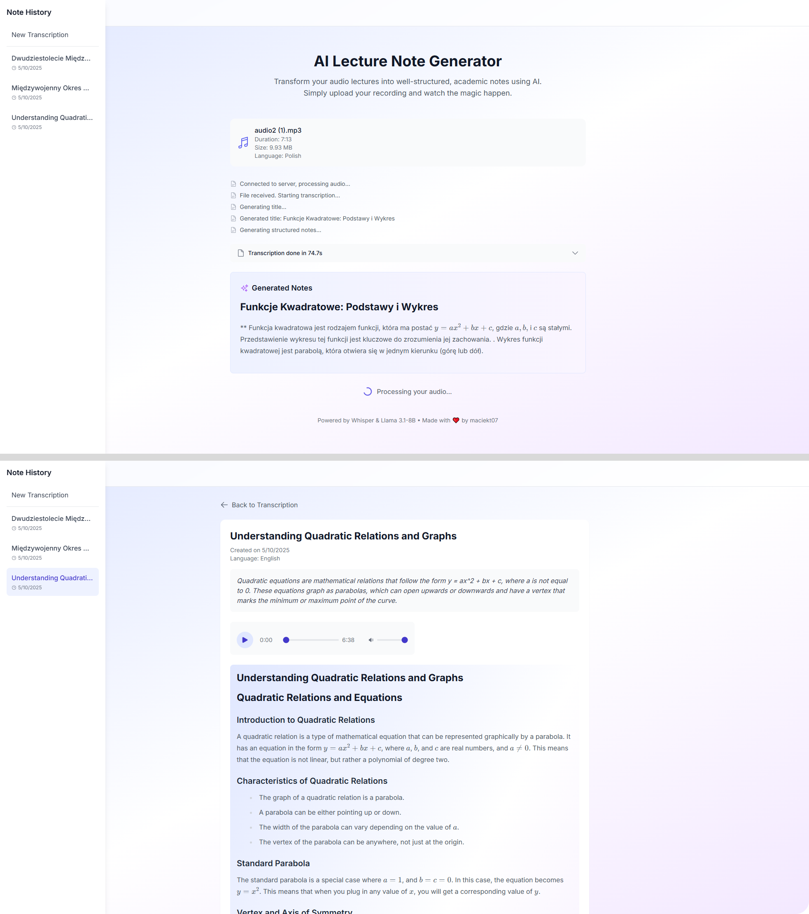

# Lecture Note Generator

<p align="center">

</p>

A web application that converts lecture audio recordings into structured academic notes. Uses Whisper for transcription and Llama 3.1-8B for note generation.



## Stack

- Frontend: React + TypeScript + Tailwind CSS
- Backend: Python + FastAPI + Whisper + Ollama

## Features

- Note history stored in a local SQLite database
- Real-time updates via WebSocket
- Math rendering with KaTeX

## Setup

### Requirements

- Python 3.8+
- Node.js
- Ollama

### Backend

```bash
cd server
pip install -r requirements.txt
uvicorn server:app --reload
```

### Frontend

```bash
cd client
npm install
npm run dev
```

Open `http://localhost:5173` in your browser.
